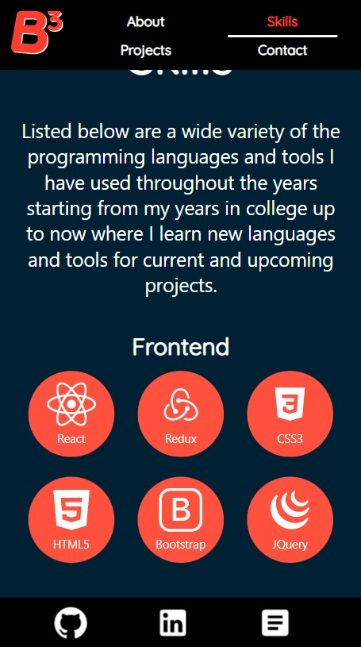

# B3 Portfolio
The portfolio website of Brett Orban
## Table of Contents
* Introduction
* Notable Languages and Tools
* Screenshots
  * Landing
  * Navigation/About
  * Skills
  * Projects
    * Project List
    * Project Overview
  * Contact
* Closure

## Introduction

Thank you for taking the time to read the B3 Portfolio Readme. This repository contains
the source code my personal website. It was in my interest to take my 
understanding of web development and put it to the test by creating 
my own website to show off all that I have learned throughout the years.

Below in the readme contains some further information about the website 
and added screenshots of the contents of the website in a condensed, 
and accessible form.

## Notable Languages and Tools

* HTML
* CSS/SCSS
* JS/Node.JS
* React
* Jest/React Testing Library

## Screenshots
Desktop screenshots were taken with a 1366x768 resolution. Mobile screenshots 
were taken with a 375x667 (iPhone SE) resolution
### Landing Page
The landing page is the first thing you see upon entering the website. 
It is a full-sized page that contains the title of the website and 
the social media/resumé icons. Upon clicking "Click here to continue!", 
you access the rest of the website.

### Navigation/About
Upon accessing the rest of the website, a navigation panel becomes 
accessible to help scroll through and show users where they are in 
the website. The logo is also visible on which if clicked, takes 
the user to the top of the website.

The about page describes a little about myself and my 
experiences. The svg image has the panels of the monitors flicker at 
random intervals and independent of each other.

### Skills

### Projects
Initially, the project list will be shown. It is a component that 
contains all the projects that I have on display. On clicking one 
of the project modals, the project overview for that specific 
project will be displayed.

The project overview has images of the project in question in both 
mobile and desktop if applicable. It will also contain a description 
of the project, the languages and tools used to make the project, 
and links to the github and/or live website.
#### Project List

#### Project Overview

### Contact
This section contains an email form which upon filling all the 
text boxes and submitting, will send an email with whatever 
message you want to send.

## Closure
Thanks for browsing this document. If you want to reach out to me, 
please refer to my contact information and socials below.

Brett Orban | [Linkedin](https://www.linkedin.com/in/brett-orban/) | 
[Website]() | [Github](https://github.com/Bretty01) | 
[Email](mailto:b3orban@gmail.com) |